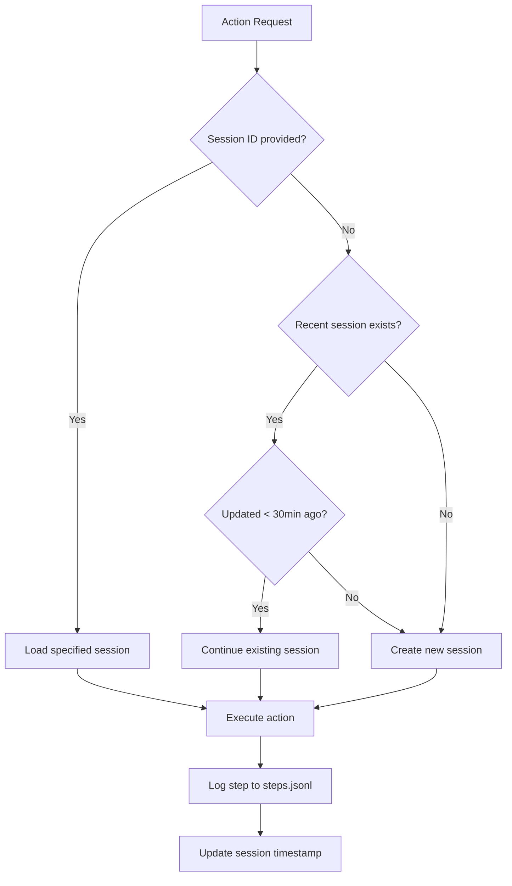

# 03 - Sessions & Steps

Implement session management and step logging for Navigator.

## Overview

Sessions group related browser actions. Steps are individual actions logged within a session. Key features:

- Auto-continuation: Same project + <30 minutes = resume existing session
- Manual override: `--session <id>` to force specific session
- Step logging: JSONL format for append-only action log
- Git ref capture: Optional branch/commit tracking

## Session Model

### Directory Structure

```
~/.local/share/navigator/{project-hash}/
└── sessions/
    └── {session-id}/
        ├── meta.json      # Session metadata
        ├── steps.jsonl    # Action log (append-only)
        └── markers/       # Marker files
            └── {marker-id}.json
```

### Meta File

```typescript
// meta.json
interface SessionMeta {
  id: string           // UUID
  projectHash: string  // SHA256 hash of project path (first 12 chars)
  projectPath: string  // Absolute path to project
  createdAt: string    // ISO 8601
  updatedAt: string    // ISO 8601
  gitRef?: string      // Commit SHA (if in git repo)
  gitBranch?: string   // Branch name (if in git repo)
}
```

### Steps File

```typescript
// steps.jsonl (one JSON object per line)
interface Step {
  id: string           // UUID
  timestamp: string    // ISO 8601
  action: Action       // The action that was executed
  result: {
    success: boolean
    error?: string
    data?: unknown     // Action-specific response
  }
  duration: number     // Execution time in ms
}
```

## Implementation

### Session Manager

```typescript
// packages/server/src/session/manager.ts
import { randomUUID } from 'crypto'
import { existsSync, mkdirSync, readFileSync, writeFileSync } from 'fs'
import { appendFile } from 'fs/promises'
import { execSync } from 'child_process'
import {
  getSessionDir,
  getSessionMetaPath,
  getSessionsDir,
  getStepsPath,
  hashProjectPath,
} from '@outfitter/navigator-core/storage'
import { SessionMetaSchema, StepSchema } from '@outfitter/navigator-core/schema'
import type { Action, SessionMeta, Step } from '@outfitter/navigator-core/schema'

const CONTINUATION_WINDOW_MS = 30 * 60 * 1000 // 30 minutes

export class SessionManager {
  private projectPath: string
  private projectHash: string
  private currentSession: SessionMeta | null = null

  constructor(projectPath: string) {
    this.projectPath = projectPath
    this.projectHash = hashProjectPath(projectPath)
  }

  /**
   * Get or create a session.
   * - If sessionId provided, use that session
   * - Otherwise, try to continue recent session (same project, <30min)
   * - Otherwise, create new session
   */
  async getOrCreateSession(sessionId?: string): Promise<SessionMeta> {
    if (sessionId) {
      return this.loadSession(sessionId)
    }

    const recent = this.findRecentSession()
    if (recent) {
      this.currentSession = recent
      return recent
    }

    return this.createSession()
  }

  private findRecentSession(): SessionMeta | null {
    const sessionsDir = getSessionsDir(this.projectPath)
    if (!existsSync(sessionsDir)) return null

    const sessions = readdirSync(sessionsDir)
      .map(id => this.tryLoadSession(id))
      .filter((s): s is SessionMeta => s !== null)
      .sort((a, b) =>
        new Date(b.updatedAt).getTime() - new Date(a.updatedAt).getTime()
      )

    if (sessions.length === 0) return null

    const latest = sessions[0]
    const elapsed = Date.now() - new Date(latest.updatedAt).getTime()

    if (elapsed < CONTINUATION_WINDOW_MS) {
      return latest
    }

    return null
  }

  private tryLoadSession(sessionId: string): SessionMeta | null {
    try {
      return this.loadSession(sessionId)
    } catch {
      return null
    }
  }

  private loadSession(sessionId: string): SessionMeta {
    const metaPath = getSessionMetaPath(this.projectPath, sessionId)
    if (!existsSync(metaPath)) {
      throw new Error(`Session not found: ${sessionId}`)
    }
    const raw = readFileSync(metaPath, 'utf-8')
    return SessionMetaSchema.parse(JSON.parse(raw))
  }

  private createSession(): SessionMeta {
    const id = randomUUID()
    const now = new Date().toISOString()

    const meta: SessionMeta = {
      id,
      projectHash: this.projectHash,
      projectPath: this.projectPath,
      createdAt: now,
      updatedAt: now,
      ...this.captureGitInfo(),
    }

    const sessionDir = getSessionDir(this.projectPath, id)
    mkdirSync(sessionDir, { recursive: true })

    const metaPath = getSessionMetaPath(this.projectPath, id)
    writeFileSync(metaPath, JSON.stringify(meta, null, 2))

    // Initialize empty steps file
    const stepsPath = getStepsPath(this.projectPath, id)
    writeFileSync(stepsPath, '')

    this.currentSession = meta
    return meta
  }

  private captureGitInfo(): { gitRef?: string; gitBranch?: string } {
    try {
      const gitRef = execSync('git rev-parse HEAD', {
        cwd: this.projectPath,
        encoding: 'utf-8',
      }).trim()

      const gitBranch = execSync('git rev-parse --abbrev-ref HEAD', {
        cwd: this.projectPath,
        encoding: 'utf-8',
      }).trim()

      return { gitRef, gitBranch }
    } catch {
      return {}
    }
  }

  /**
   * Log a step to the current session
   */
  async logStep(action: Action, result: Step['result'], duration: number): Promise<Step> {
    if (!this.currentSession) {
      throw new Error('No active session')
    }

    const step: Step = {
      id: randomUUID(),
      timestamp: new Date().toISOString(),
      action,
      result,
      duration,
    }

    // Validate before writing
    StepSchema.parse(step)

    // Append to steps file
    const stepsPath = getStepsPath(this.projectPath, this.currentSession.id)
    await appendFile(stepsPath, JSON.stringify(step) + '\n')

    // Update session timestamp
    await this.touchSession()

    return step
  }

  private async touchSession(): Promise<void> {
    if (!this.currentSession) return

    this.currentSession.updatedAt = new Date().toISOString()
    const metaPath = getSessionMetaPath(this.projectPath, this.currentSession.id)
    writeFileSync(metaPath, JSON.stringify(this.currentSession, null, 2))
  }

  /**
   * Read all steps from the current session
   */
  async getSteps(): Promise<Step[]> {
    if (!this.currentSession) {
      throw new Error('No active session')
    }

    const stepsPath = getStepsPath(this.projectPath, this.currentSession.id)
    if (!existsSync(stepsPath)) return []

    const content = readFileSync(stepsPath, 'utf-8')
    return content
      .split('\n')
      .filter(line => line.trim())
      .map(line => StepSchema.parse(JSON.parse(line)))
  }
}
```

### Integration with Action Executor

```typescript
// packages/server/src/executor/index.ts
import type { Action } from '@outfitter/navigator-core/schema'
import { SessionManager } from '../session/manager'

export class ActionExecutor {
  private session: SessionManager
  private browser: BrowserController

  constructor(projectPath: string, browser: BrowserController) {
    this.session = new SessionManager(projectPath)
    this.browser = browser
  }

  async execute(action: Action, sessionId?: string): Promise<unknown> {
    // Ensure session exists
    await this.session.getOrCreateSession(sessionId)

    const start = Date.now()
    let result: { success: boolean; error?: string; data?: unknown }

    try {
      const data = await this.browser.execute(action)
      result = { success: true, data }
    } catch (err) {
      result = {
        success: false,
        error: err instanceof Error ? err.message : String(err),
      }
    }

    const duration = Date.now() - start

    // Log step
    await this.session.logStep(action, result, duration)

    if (!result.success) {
      throw new Error(result.error)
    }

    return result.data
  }
}
```

## CLI Integration

```typescript
// packages/cli/src/commands/index.ts
import { Command } from 'commander'

// Global --session option
program
  .option('-s, --session <id>', 'Use specific session ID')

// Each command passes session ID to executor
program
  .command('click <ref>')
  .action(async (ref, options) => {
    const globalOpts = program.opts()
    await client.execute(
      { action: 'click', ref },
      { sessionId: globalOpts.session }
    )
  })
```

## Auto-Continuation Logic



## Verification

- [ ] Sessions auto-continue within 30 minutes
- [ ] `--session <id>` overrides auto-continuation
- [ ] Steps append correctly to JSONL
- [ ] Git info captured when in git repo
- [ ] Session not found error for invalid IDs

## Dependencies

- Phase 2 complete (core types)

## Reference

See trails codebase patterns:
- `packages/server/src/session/` for session model
- JSONL format for append-only logs
